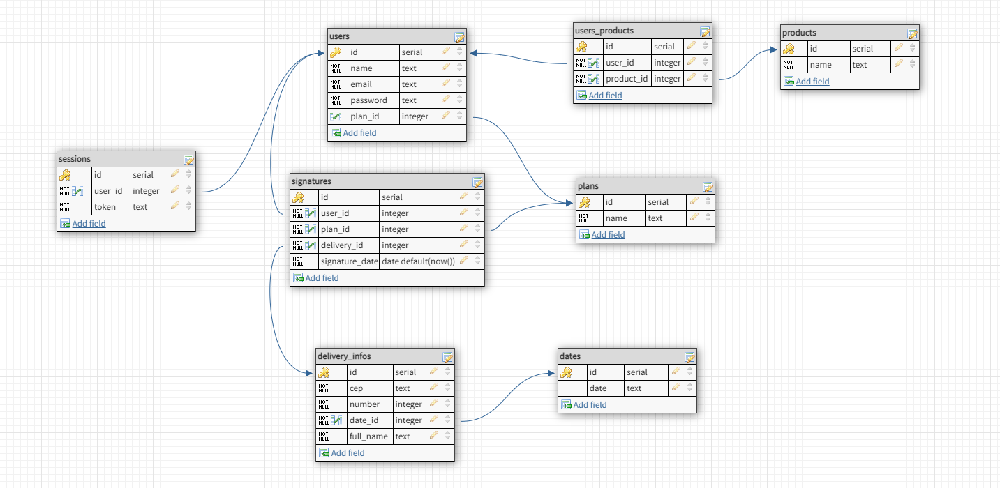

<h1 align="center">
   ☯️ <a href="#"> GratiBox API </a>
</h1>

<h3 align="center">
    Receive at home a box with teas, organic products, incense and much more...
</h3>

<h4 align="center"> 
	 Status: Finished
</h4>

<p align="center">
 <a href="#about">About</a> •
 <a href="#layout">Database Layout</a> • 
 <a href="#how-it-works">How it works</a> • 
 <a href="#pre-requisites">Pre-requisites</a> • 
 <a href="#tech-stack">Tech Stack</a> • 
 <a href="#how-to-contribute">How to contribute</a> • 
 <a href="#author">Author</a> • 
</p>


## About

Aiming to encourage a healthier lifestyle, GratiBox is a startup that delivers box with healthy and #gratitude products. Customers can choose between two recurring subscription plans, weekly or monthly. Each box contains assorted products such as teas, organic products, incense sticks. Customers cannot choose the products and do not know what will be sent in each box.

---


## Database Layout



The database was designed at https://www.dbdesigner.net/ for PostgreSQL.

``` postgresql

/* In your psql terminal */
CREATE DATABASE gratibox;

/* Access the database */
\c gratibox

```
Now, just run the commands listed in <a href="https://github.com/okitauehara/gratibox-api/blob/main/dump.sql">dump.sql</a>

---

## How it works

This project is divided into two parts:
1. Backend (This repository)
2. Frontend (You can find here: https://github.com/okitauehara/gratibox)

---

## Pre-requisites

Before you begin, you will need to have the following tools installed on your machine:
[Git](https://git-scm.com), [Node.js](https://nodejs.org/en/), [VSCode](https://code.visualstudio.com/).

### Running the Backend (server)

``` jsx

// Clone this repository
$ git clone git@github.com:okitauehara/gratibox-api.git

// Access the project folder cmd/terminal
$ cd gratibox-api

// Install the dependencies
$ npm install

// Create a .env.dev file and fill it using your environment variables following the .env.example

// Run the application in development mode
$ ntl -> start:dev

// The server will start at port: 4000

```
You can find the .env.example <a href="https://github.com/okitauehara/gratibox-api/blob/main/.env.example">here</a>

---

## Tech Stack

The following tools were used in the construction of the project-api:

**Server**  ([NodeJS](https://nodejs.org/en/))

-   **[Express](https://expressjs.com/)**
-   **[CORS](https://expressjs.com/en/resources/middleware/cors.html)**
-   **[bcrypt](https://github.com/kelektiv/node.bcrypt.js)**
-   **[NTL](https://github.com/ruyadorno/ntl)**
-   **[pg](https://github.com/brianc/node-postgres)**
-   **[dotENV](https://github.com/motdotla/dotenv)**
-   **[UUID](https://github.com/uuidjs/uuid)**
-   **[Faker](https://github.com/Marak/Faker.js)**
-   **[Joi](https://github.com/hapijs/joi)**
-   **[Husky](https://github.com/typicode/husky)**
-   **[Jest](https://github.com/facebook/jest)**
-   **[Supertest](https://github.com/visionmedia/supertest)**
-   **[Eslint - Airbnb](https://github.com/airbnb/javascript)**
-   **[Prettier](https://github.com/prettier/prettier)**

> See the file  [package.json](https://github.com/okitauehara/gratibox-api/blob/main/package.json)

**Utilitários**

-   API:  **[Brasil API](https://github.com/BrasilAPI/cep-promise)**
-   Editor:  **[Visual Studio Code](https://code.visualstudio.com/)**
-   API Test:  **[Insomnia](https://insomnia.rest/)**, **[Thunder Client](https://www.thunderclient.io/)**


---


## How to contribute

1. Fork the project.
2. Create a new branch with your changes: `git checkout -b feat/myFeatureName`
3. For each feature implemented, make a commit specifying what was done
4. Submit your changes: `git push -u origin feat/myFeatureName`

---

## Author

Developed by Marcos Okita Uehara.
